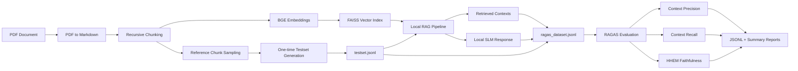

# Local SLM RAG — Evaluation & Benchmarking Fork

> **Evaluation add-on for a fully local Retrieval-Augmented Generation pipeline.**  
> This fork extends the original `slm_rag` project with a reproducible benchmarking workflow built around **RAGAS 0.3.9**, local retrieval/generation, persisted JSONL datasets, and a deliberately minimized use of external LLM calls.

The original project runs the RAG pipeline locally: documents are converted to Markdown, split into chunks, embedded with a SentenceTransformer model, indexed in FAISS, retrieved by semantic similarity, and passed to a local small language model for generation. This fork keeps that pipeline intact and adds an evaluation layer around it.

The goal is to measure **whether the right evidence was retrieved and whether the generated answer stayed faithful to that evidence**.

---

## System Architecture and Add-on

The evaluation package is designed as an **add-on around the existing local RAG system**, rather than a replacement for it. This keeps inference behavior unchanged and makes the benchmark useful for comparing future changes to chunking, embeddings, retrieval settings, prompting, or the local generator.



### What the fork adds

The evaluation workflow introduces four layers around the original RAG pipeline:

1. **Benchmark dataset construction** — source chunks are sampled deterministically and an external OpenAI-compatible model is used to create a question and ground-truth answer from each selected chunk. The reference context itself is never synthesized; it is stored as the exact chunk text produced by the RAG chunker.
2. **RAG benchmark execution** — the existing local RAG pipeline answers every benchmark question and records both its response and the contexts it actually retrieved.
3. **RAGAS scoring** — retrieval is evaluated with non-LLM metrics, while answer faithfulness is verified locally with Vectara HHEM.
4. **Persistent artifacts** — benchmark rows, RAG outputs, raw metric scores, and aggregate summaries are saved as JSON/JSONL so runs can be inspected, resumed, and compared.

This separation makes the evaluation useful for controlled experiments. A retriever, chunk size, `top_k`, embedding model, prompt, or SLM can be changed while the same benchmark set is reused.

---

## Local Eval and Metrics

A central design goal of this fork is to keep **as much evaluation work local as practical**.

| Stage | Execution | Purpose |
|---|---|---|
| Document parsing / chunking | Local | Produce the exact corpus used by the RAG system |
| Embeddings + FAISS retrieval | Local | Retrieve candidate evidence |
| SLM answer generation | Local | Run the system under evaluation |
| `NonLLMContextPrecisionWithReference` | Local / non-LLM | Measure how much retrieved context matches the expected reference context |
| `NonLLMContextRecall` | Local / non-LLM | Measure how much of the expected reference context was successfully retrieved |
| `FaithfulnesswithHHEM` verification | Local | Check whether claims in the response are supported by retrieved context using `Vectara HHEM-2.1-Open` |
| Test question + answer generation | External API, one-time | Build a reusable synthetic benchmark from real source chunks |
| Faithfulness claim extraction | External API | Extract claims before local HHEM verification |

### Benchmark snapshot

An included 20-sample evaluation run produced:

| Metric | Mean score |
|---|---:|
| Context Precision with Reference | **0.6000** |
| Context Recall | **0.6500** |
| Faithfulness with HHEM | **0.8792** |

The result is most useful as a **baseline**, not as an absolute quality claim. Future changes can be benchmarked against the same persisted testset to determine whether retrieval coverage, retrieval precision, or grounded generation actually improved.

### Reproducibility and resumability

The benchmark is intentionally persisted in stages:

```text
source document
      ↓
testset.jsonl
      ↓
ragas_dataset.jsonl
      ↓
raw_scores.jsonl
      ↓
summary.json + summary.md
```

`TESTSET_RANDOM_SEED` makes source-chunk selection deterministic. Existing benchmark rows are reused unless regeneration is explicitly requested, and RAG execution appends completed rows as it progresses. If a run is interrupted, already completed questions do not need to be generated or answered again.

---

## Project Structure

```text
.
├── rag_demo.ipynb
├── data/
│   ├── document.pdf
│   └── document.md
│
├── src/                         # Original local RAG pipeline
│   ├── document_loader.py       # PDF → page-aware Markdown
│   ├── chunking.py              # Recursive chunking + metadata
│   ├── embedding.py             # BGE SentenceTransformer embeddings
│   ├── vector_store.py          # FAISS inner-product vector search
│   ├── prompt_constructor.py    # Retrieved-context prompt construction
│   ├── lm.py                    # Local Hugging Face causal LM
│   └── rag_pipeline.py          # End-to-end local RAG orchestration
│
├── evaluation/                  # Evaluation add-on introduced by this fork
│   ├── config.py                # Paths, evaluator model, test size, top-k, HHEM settings
│   ├── evaluation_dataset.py    # Typed schemas + JSONL persistence + RAGAS conversion
│   ├── datasetbuilder.py        # Build/reuse the synthetic reference benchmark
│   ├── rag_runner.py            # Execute the local RAG pipeline over the benchmark
│   ├── metrics.py               # Configure and run the three RAGAS metrics
│   ├── results.py               # Save raw per-row scores and aggregate summaries
│   └── evaluator.py             # End-to-end evaluation CLI/orchestrator
│
├── EvaluationData/              # Generated benchmark/evaluation artifacts
│   ├── testset/
│   │   └── testset.jsonl
│   ├── ragas_dataset/
│   │   └── ragas_dataset.jsonl
│   └── results/
│       ├── raw_scores.jsonl
│       ├── summary.json
│       └── summary.md
│
└── requirements.txt
```

### Evaluation Datasets

Each stage adds only the fields it owns.

**Reference Testset sample**

```json
{
  "user_input": "...",
  "reference_contexts": ["exact source chunk ..."],
  "ground_truth_answer": "..."
}
```

**Completed RAGAS Evaluation Dataset sample**

```json
{
  "user_input": "...",
  "reference_contexts": ["exact source chunk ..."],
  "reference": "ground_truth_answer",
  "response": "local SLM answer ...",
  "retrieved_contexts": ["retrieved chunk 1 ...", "retrieved chunk 2 ..."]
}
```

---

## Configuration and Usage

### 1. Install dependencies

Python dependencies for both the local RAG system and evaluation layer are defined in `requirements.txt`.

```bash
pip install -r requirements.txt
```

The explicit version bounds are intentional because the evaluator uses the RAGAS 0.3.9 metric interfaces and `LangchainLLMWrapper` behavior expected by that release.

### 2. Configuration

Edit `evaluation/config.py`.

```python
EVAL_API_KEY = "YOUR_API_KEY"
EVAL_API_BASE_URL = None      # or an OpenAI-compatible /v1 endpoint if you are using one
EVAL_API_MODEL = "YOUR_EVAL_MODEL"

TESTSET_SIZE = 20             # The number of testset samples
TESTSET_RANDOM_SEED = 42
MIN_REFERENCE_CHARS = 180
RAG_TOP_K = 3

HHEM_DEVICE = "cpu"
HHEM_BATCH_SIZE = 10
```

Any OpenAI-compatible endpoint can be used.

### 3. Run the complete evaluation

From the project root:

```bash
python -m evaluation.evaluator
```

The orchestrator performs the full workflow in order:

```text
build/reuse testset
        ↓
run local RAG on test questions
        ↓
convert rows to a RAGAS EvaluationDataset
        ↓
calculate retrieval + faithfulness metrics
        ↓
save raw scores and aggregate summaries
```

---

## Other Options

### 4. Explicitly regenerate the testset

```bash
python -m evaluation.evaluator --force-testset

```

`--force-testset` deletes and rebuilds the benchmark, so it triggers new external API calls.
For fair before/after comparisons, reuse the same persisted testset whenever possible.

### 6. Run stages independently

The evaluation modules can also be executed separately when debugging or benchmarking one stage at a time:

```bash
# Build/reuse benchmark questions
python -m evaluation.datasetbuilder

# Run the local RAG pipeline over the testset
python -m evaluation.rag_runner

# Full orchestration + scoring + result persistence
python -m evaluation.evaluator
```

### Output artifacts

After evaluation, the most useful files are:

- `EvaluationData/testset/testset.jsonl` — reusable benchmark questions, ground-truth answers, and exact reference chunks.
- `EvaluationData/ragas_dataset/ragas_dataset.jsonl` — benchmark rows enriched with local RAG responses and retrieved contexts.
- `EvaluationData/results/raw_scores.jsonl` — per-sample RAGAS outputs for detailed error analysis.
- `EvaluationData/results/summary.json` — machine-readable aggregate metrics and run metadata.
- `EvaluationData/results/summary.md` — compact human-readable benchmark report.
